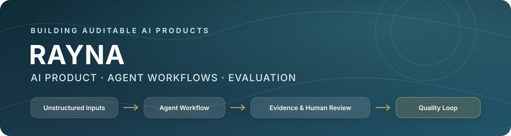

  

  
  
  
  

<strong>English</strong> · <a href="README.zh-CN.md">简体中文</a>

## About Me

I build AI product workflows for complex, unstructured inputs—turning documents and user feedback into traceable decisions through rules, models, code, and human review.

My current work focuses on AI agents for long-document workflows and output-quality governance. I care not only about whether a model can produce an answer, but whether the result can be traced to evidence, reviewed by a human, and safely rejected when its support is insufficient.

I am pursuing an MSc in Artificial Intelligence and Digital Media at Hong Kong Baptist University, with a background in data science.

## What I Work On

- **Agent and workflow products:** breaking complex tasks into controlled steps across models, rules, programs, and human decisions.
- **AI evaluation and quality loops:** evidence binding, badcase analysis, QA gates, human review, and reproducible run records.
- **Product delivery:** problem framing, workflow design, PRDs, prototypes, validation plans, and public demos with explicit boundaries.

## Industry Work

### AI product internship · bid-document agent

I work on AI workflows for long, high-stakes bid documents. My contributions include decomposing rule/model/program responsibilities, designing evidence and review boundaries, investigating badcases, and governing long-document outline generation with traceable artifacts and quality gates. A high-risk clause detection workflow I helped iterate was integrated into the product's main process.

This is private industry work. No proprietary code, client documents, or internal datasets are published here.

## Featured Projects

### [Release Feedback Risk Workbench](https://github.com/Rayna-RRR/feedback-triage-agent)

**[Live demo](https://feedback-triage-agent.vercel.app/)** · Personal project

An evidence-first workflow for monitoring post-release feedback across 24–72 hour windows. It connects issue clustering, original evidence, confidence, human review, ownership, and follow-up validation. The public version is a workflow demo, not a production deployment.

### [AI App Feedback Analysis](https://github.com/Rayna-RRR/ai-app-feedback-analysis)

A structured analysis of 30 public reviews across three AI apps, with 10+ annotation fields, a coding guide, QA checks, and product recommendations. It provides the labeling and quality baseline behind the feedback workbench; the small public sample is not treated as population-level evidence.

### [Agent Instruction Smells](https://github.com/Rayna-RRR/agent-instruction-smells)

A bilingual, copyable catalog of bad-to-fixed examples for `AGENTS.md`, `CLAUDE.md`, `SKILL.md`, and other coding-agent instruction files, covering conflicts, stale commands, context bloat, unsafe shortcuts, and review boundaries.

### [Agent Project Lab](https://github.com/Rayna-RRR/agent-project-lab)

A local-first CLI for turning rough project ideas into agent-ready briefs, repository rules, task prompts, reusable skills, and run logs. It focuses on clearer context and safer, repeatable AI-assisted development workflows.

## Now Building

- **Solar Sync:** an embodied interaction prototype exploring how mouse, keyboard, and optional camera signals can share one deterministic control loop.
- **情绪小怪物:** an early-stage emotional interaction concept currently in problem discovery and MVP definition.

These are active explorations, not completed or validated products yet.

## Product & Technical Radar

| Layer | Current practice |
| --- | --- |
| Product | Problem framing, requirements, workflow design, PRDs, prototypes, validation plans |
| Agent workflows | LLM applications, structured outputs, tool orchestration, prompt and artifact contracts |
| Quality | Evidence binding, human-in-the-loop review, badcases, QA gates, evaluation harnesses |
| Build | Python, FastAPI, TypeScript, HTML/CSS, GitHub Actions, Codex |

## Education

- **MSc, Artificial Intelligence and Digital Media** — Hong Kong Baptist University, 2025–2026

## Current Direction

Open to 2027 graduate roles in **AI Product Management**, **Agent / Workflow products**, and **AI evaluation or quality loops**—with Shenzhen as my primary target and Hong Kong also in scope.

## Contact

[Email](mailto:rayna162002@163.com) · [GitHub](https://github.com/Rayna-RRR) · [Release Feedback Risk Workbench](https://feedback-triage-agent.vercel.app/)
